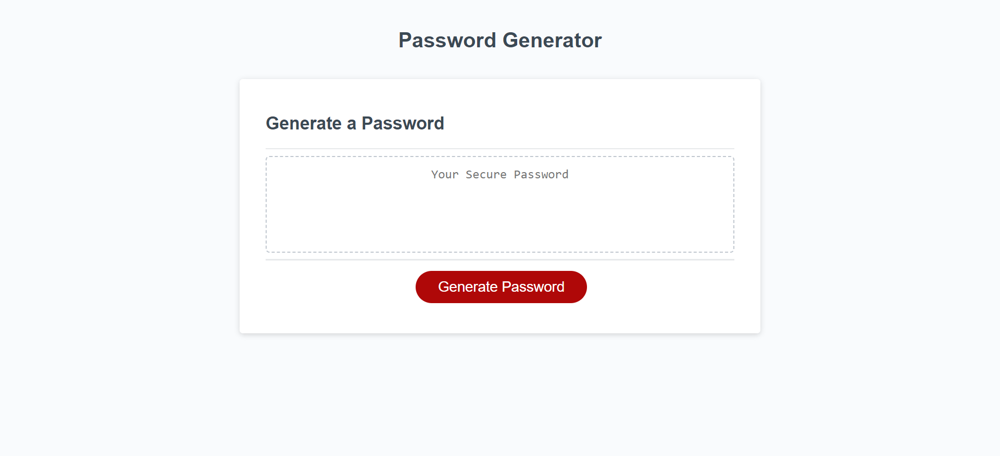

# Password-Generator

## Description

In this project, the developer is given a starter code to build a browser application that will generate random passwords according to criterias specified by the user. In the process of building this application, developer can consolidate their learning of javascript functions taught in week 3 of coding bootcamp.

You can access the application at 

## Usage

Below is a screenshot of the deployed webpage

Click on the 'Generate Password' button to enter your password inclusion criterias, such as password length and types of characters.
This password generator can output passwords between 8 to 128 characters.  

## Support

Please reach out to Sandy Hung at sandyhung83@yahoo.com.tw if you have any questions or comments regarding this project. Alternatively, head on to my GitHub at https://github.com/Sandy5433 to see more exciting projects.

## Roadmap

New coding projects will be released every Wednesday night. My first project, refactoring html/css code, can be found on my GitHub.

## Contributing

If you would like to contribute to the development of this password generator application, you can reach out to me via the contact details on my portfolio webpage. 

## Authors and acknowledgment

Many thanks to my instructors and tutors from USYD coding bootcamp who stayed back after class to support me on my journey in coding.

## Project status

Completed 01/12/2022
